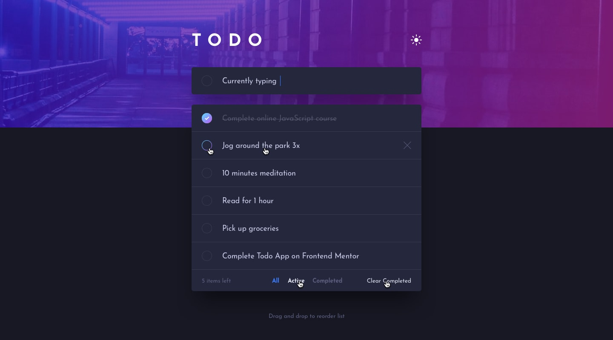

# 📝 Todo App with Vanilla JS

A minimalist todo application built with pure JavaScript featuring dark/light mode and API integration.

## ✨ Features

### 🎯 Core Functions
- Add new tasks with Enter key
- Mark tasks as complete/incomplete
- Delete tasks individually
- Clear all completed tasks
- Filter tasks (All/Active/Completed)

### 🎨 UI Features
- 🌓 Dark/Light mode toggle
- 📱 Responsive design

### 🛠️ Tech Stack

- Frontend: Vanilla JavaScript

- Styling: Pure CSS

- API: Routemisr Todo API

### API Integration

 ## Uses Routemisr Todo API for:

- Fetching all tasks (GET)

- Adding new tasks (POST)

- Updating completion status (PUT)

- Deleting tasks (DELETE)